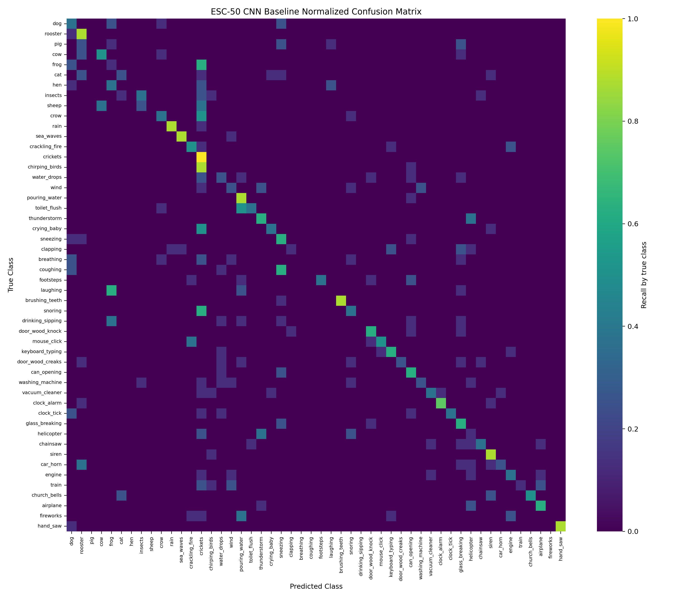
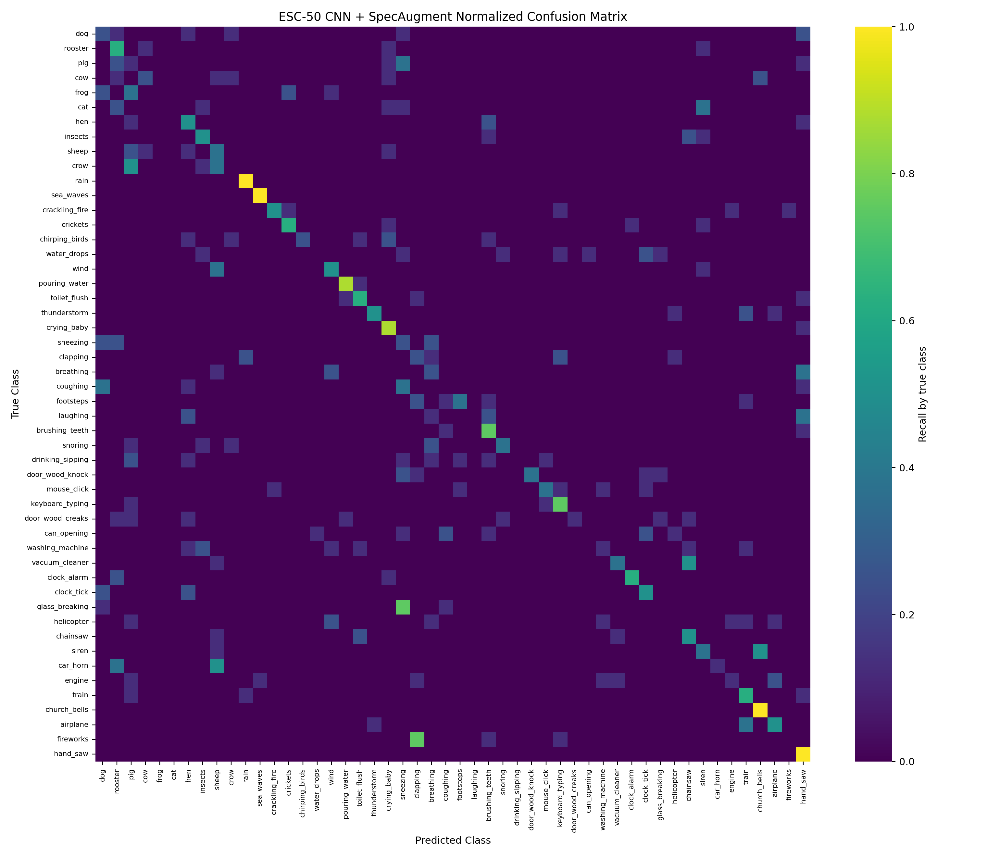

# ESC-50 声音事件分类实验结果分析

## 1. 实验目的

本阶段实验围绕 ESC-50 单标签声音事件分类任务展开，目标是验证项目计划中的三条核心技术路线：第一，使用 Log-Mel Spectrogram 与轻量 CNN 建立可复现 baseline；第二，在 CNN baseline 上加入 SpecAugment，观察频谱增强是否改善泛化；第三，使用 AudioSet 预训练的 Audio Spectrogram Transformer（AST）进行迁移微调，评估预训练 Transformer 在小规模环境声音数据集上的优势。

这三组实验对应从“从头训练的小模型”到“带数据增强的小模型”，再到“预训练 Transformer 微调”的递进关系。比较它们可以回答项目计划中的关键问题：在 ESC-50 这类小样本数据集上，预训练 AST/ViT 类模型是否明显优于简单 CNN baseline，以及数据增强是否能在小模型上带来稳定收益。

## 2. 数据集与划分

实验使用 ESC-50 数据集。该数据集包含 50 个环境声音类别，每类 40 条音频，共 2000 条样本。项目采用 ESC-50 官方 fold 划分，其中 fold 1-4 作为训练集，fold 5 作为验证集。对应样本规模为：

| 划分 | Fold | 样本数 |
| --- | --- | ---: |
| 训练集 | 1, 2, 3, 4 | 1600 |
| 验证集 | 5 | 400 |

所有实验都使用相同训练/验证划分，以保证模型之间的比较尽可能公平。CNN baseline 和 CNN + SpecAugment 使用 32 kHz 音频与 Log-Mel Spectrogram 特征；预训练 AST 使用 16 kHz 输入，以匹配 Hugging Face 预训练 AST 模型的默认音频设置。

## 3. 实验设置

### 3.1 CNN Baseline

CNN baseline 使用 `configs/esc50_baseline.yaml`。该实验先将音频转换为 Log-Mel Spectrogram，再输入三层卷积模块和全局池化分类头。该模型参数量较小，主要用于验证数据读取、特征提取、训练循环、指标记录和 Slurm 流程是否完整可运行。

### 3.2 CNN + SpecAugment

CNN + SpecAugment 使用 `configs/esc50_cnn_specaugment.yaml`。模型结构、数据划分和训练轮数与 CNN baseline 保持一致，只在训练阶段对 Log-Mel Spectrogram 随机进行时间遮挡和频率遮挡。验证阶段不启用增强，以保证评价口径与 baseline 一致。

该实验的目的不是更换模型，而是观察频谱增强是否能降低小模型对局部时间片段或频带的依赖，从而改善泛化表现。

### 3.3 Pretrained AST Fine-tuning

预训练 AST 使用 `configs/esc50_ast.yaml`。模型基于 `MIT/ast-finetuned-audioset-10-10-0.4593` 初始化，该模型已在 AudioSet 上进行预训练/微调。由于 AudioSet 原模型分类头对应 527 类，而 ESC-50 只有 50 类，因此实验重新初始化分类头，同时保留 AST 主干的预训练表征。

该实验用于验证项目主线假设：在 ESC-50 小规模数据集上，使用大规模音频数据预训练得到的 Transformer 表征，是否能够显著优于从头训练的轻量 CNN。

## 4. 整体结果

三组实验的主要指标如下：

| 实验 | 配置文件 | 最佳轮次 | 最佳验证 Accuracy | 最佳验证 Loss | 最后一轮训练 Accuracy | 最后一轮验证 Accuracy |
| --- | --- | ---: | ---: | ---: | ---: | ---: |
| CNN baseline | `configs/esc50_baseline.yaml` | 19 | 0.4125 | 2.0202 | 0.4688 | 0.4075 |
| CNN + SpecAugment | `configs/esc50_cnn_specaugment.yaml` | 19 | 0.4200 | 2.0417 | 0.4006 | 0.3825 |
| Pretrained AST | `configs/esc50_ast.yaml` | 4 | 0.9300 | 0.2205 | 1.0000 | 0.9225 |

从结果看，CNN baseline 的最佳验证 Accuracy 为 0.4125，明显高于 50 类随机分类约 0.0200，说明基础训练流程有效。SpecAugment 将最佳验证 Accuracy 提升到 0.4200，相比 baseline 提升 +0.0075，但提升幅度很小。预训练 AST 的最佳验证 Accuracy 达到 0.9300，相比 CNN baseline 提升 +0.5175，说明 AudioSet 预训练 AST 在 ESC-50 上具有显著迁移优势。

## 5. 训练曲线分析

CNN baseline 的训练曲线显示，训练 Accuracy 和验证 Accuracy 随 epoch 整体上升，但后期验证 Accuracy 波动明显，最佳值出现在第 19 轮。该现象说明轻量 CNN 能够学习到一部分环境声时频模式，但泛化能力仍然有限。

CNN + SpecAugment 的训练 Accuracy 低于 baseline，说明频谱遮挡增加了训练难度。验证 Accuracy 在第 19 轮达到 0.4200，但最后一轮回落到 0.3825，表明当前增强强度可能带来一定正则化效果，但稳定性不足。

预训练 AST 在前几轮迅速收敛，第 4 轮达到最佳验证 Accuracy 0.9300，随后验证 Accuracy 仍保持在 0.90 以上。与 CNN 相比，AST 的收敛速度和验证性能都明显更强。这说明预训练模型已经具备较好的音频语义表征，ESC-50 微调主要是在任务类别上进行适配，而不是从零学习声音事件特征。

## 6. 混淆矩阵与类别级表现

CNN baseline 的混淆矩阵中，只有部分类别形成明显对角线，很多类别仍被分散预测到其它类别。这说明轻量 CNN 对相似声学事件的区分能力不足，尤其当类别之间共享噪声型、冲击型或持续型声学模式时更容易混淆。

SpecAugment 的混淆矩阵整体与 baseline 接近，部分类别有所改善，但仍存在较多低准确类别。结合整体 Accuracy，仅凭当前一次实验还不能说明 SpecAugment 稳定有效。更合理的结论是：SpecAugment 在当前设置下带来轻微正向变化，但仍需要调参或多 fold 验证。

AST 的混淆矩阵呈现清晰对角线，大部分类别都能被正确识别。类别级结果显示，即使表现较弱的类别也明显优于 CNN 实验，例如当前 AST 摘要中最弱类别 `helicopter` 的 Accuracy 为 0.5000，其余弱类如 `pig`、`door_wood_creaks`、`airplane` 分别达到 0.6250、0.7500 和 0.7500。相比之下，CNN 和 SpecAugment 实验中存在多个 Accuracy 为 0 的类别，例如 CNN baseline 中 `pig`、`hen`、`sheep`、`chirping_birds` 和 `breathing` 均未被正确识别。

当前已同步 ESC-50 官方元数据 `metadata/esc50.csv`，因此类别级图表和摘要均使用真实类别名称，便于在报告中讨论具体错误类别。

## 7. 讨论

三组实验表明，简单 CNN baseline 可以快速建立完整分类流程，但在 ESC-50 上的性能有限。其主要价值是提供可复现参照，并证明数据处理、特征提取和评估代码是有效的。SpecAugment 在 CNN 上只带来 +0.0075 的最佳验证 Accuracy 提升，说明单纯频谱遮挡对当前轻量模型帮助有限，或者当前遮挡参数并不是最优。考虑到 SpecAugment 最后一轮验证 Accuracy 回落，后续若继续研究增强策略，应尝试更弱遮挡、多次重复实验或多 fold 交叉验证。

AST 的结果最能支撑项目主线。其性能显著高于 CNN baseline，说明在小规模声音事件分类任务中，模型能否利用大规模预训练表征比单纯从头训练结构更重要。AudioSet 预训练为 AST 提供了丰富的声音事件知识，ESC-50 微调则将这些知识适配到 50 个环境声类别。该结果与文献综述中的判断一致：音频 Transformer 在小数据集上通常依赖预训练，而不是从头训练。

从研究问题角度看，当前实验已经回答了两个核心问题。第一，ESC-50 上完整声音事件分类流程已经跑通，并产生了可复现指标、曲线和混淆矩阵。第二，预训练 AST 相比 CNN baseline 表现显著更好，是当前项目最适合写入报告的主要模型结果。SpecAugment 可以作为训练策略比较的一部分，但不应被描述为主要性能来源。

## 8. 局限性

当前实验仍有一些限制。首先，结果基于单一 fold 划分，虽然 ESC-50 官方 fold 保证了基本可比性，但如果要得到更稳健结论，仍应进行 5-fold 交叉验证。其次，AST 微调虽然效果强，但训练集 Accuracy 最后一轮达到 1.0000，说明模型容量较大，仍需要关注小数据集过拟合问题。最后，实验尚未覆盖 FSD50K 或多标签任务，因此结论主要适用于 ESC-50 单标签分类。

## 9. 后续工作

后续可以从三个方向继续完善。第一，结合真实类别名进一步分析 `helicopter`、`pig`、`door_wood_creaks`、`airplane` 等 AST 相对较弱类别的错误来源。第二，如果时间允许，运行更多 fold 或调整 AST 训练轮数、学习率、冻结策略，以验证 0.9300 Accuracy 是否稳定。第三，在最终报告中将 FSD50K、多标签分类和音视频迁移作为未来工作，而不是继续扩大当前工程范围。

总体而言，当前实验已经形成清楚结论：CNN baseline 证明流程可行，SpecAugment 提供轻微增强，而预训练 AST 显著提升 ESC-50 分类性能，是本项目的核心实验结果。
