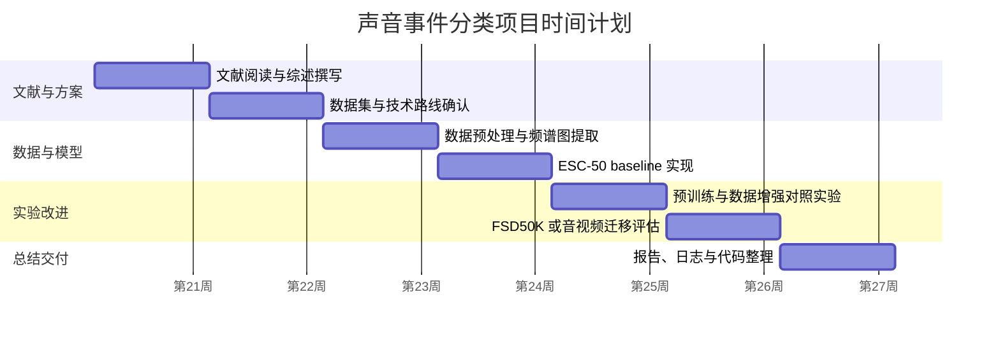

# 基于 Mel-Spectrogram 与 Vision Transformer 的声音事件分类研究：文献综述与项目计划

## 1. 项目背景

### 1.1 研究领域

声音事件分类（Sound Event Classification, SEC）属于计算机听觉与音频理解领域，目标是让模型根据一段音频判断其中包含的声音事件类别，例如动物叫声、自然环境声、交通声、人类活动声或机械声等。与语音识别主要关注语言内容不同，声音事件分类更关注非语音声学场景中的语义事件，因此在智能安防、环境监测、智慧城市、辅助听觉、音视频内容理解和多媒体检索等任务中具有实际价值。

本项目聚焦“基于深度学习的声音事件分类”，主线方案是将原始音频转换为 Mel-Spectrogram，再借鉴 Vision Transformer（ViT）或 Audio Spectrogram Transformer（AST）的建模方式，把频谱图划分为 patch 后输入 Transformer 进行分类。该路线的核心思想是：Mel-Spectrogram 可以把音频信号表示为二维时频图像，模型既可以学习局部频率纹理，也可以利用自注意力机制捕捉长时间范围内的全局依赖。

### 1.2 当前研究现状

早期声音事件分类通常依赖手工声学特征，例如 MFCC、谱质心、过零率等，再结合 SVM、随机森林或浅层神经网络进行分类。深度学习兴起后，卷积神经网络（CNN）逐渐成为音频分类主流方法。CNN 可以直接处理 Mel-Spectrogram 或 Log-Mel 特征，在 ESC-50、UrbanSound8K、AudioSet 等数据集上取得较好结果。不过，CNN 的局部卷积结构天然偏向局部模式建模，虽然可以通过堆叠层数扩大感受野，但对长时间依赖和全局结构的建模仍存在一定限制。

Transformer 最初在自然语言处理领域取得成功，随后 ViT 将图像切分为固定大小 patch，并把 patch 序列输入 Transformer 编码器，实现了不依赖卷积的图像分类模型。ViT 在 ICLR 2021 发表后，推动了“把非文本数据转化为 token 序列再用 Transformer 建模”的思路。对音频任务而言，Mel-Spectrogram 与图像类似，具有二维结构，因此可以借鉴 ViT 的 patch 切分方式，将频谱图作为 Transformer 输入。

AST 是该思路在音频分类任务中的直接代表。AST 将音频频谱图划分为 patch，使用纯 Transformer 结构进行音频分类，并在 AudioSet、ESC-50、Speech Commands 等数据集上取得较强表现。AST 的意义在于证明：在具备合适预训练和微调策略时，卷积并不是音频分类的必要条件，频谱图上的全局自注意力同样可以学习有效的声音事件表征。

近年来，音频自监督学习和多模态学习也成为重要方向。Audio-MAE 将 Masked Autoencoder 思想迁移到音频频谱图，通过遮蔽并重建频谱 patch 学习通用音频表征。VATT 则从视频、音频、文本三种模态中进行自监督表示学习，为将 video-audio 模型迁移到声音事件分类提供了参考。ISMIR 2021 的 Semi-supervised Music Tagging Transformer 说明 Transformer 与半监督学习也可以用于音频/音乐标签分类任务，对本项目的小样本和标签不足风险具有借鉴意义。

### 1.3 项目研究背景与意义

本项目的课程要求明确提出两个模型方向：一是 Vision Transformer 方向，即将音频转换为 Mel-Spectrogram 后使用 Transformer/ViT 分类；二是 Video-Audio 模型迁移方向，即尝试将音视频相关模型应用到声音事件场景。结合课程项目的时间和工程可行性，本文将第一方向确定为主线，将第二方向作为备选或扩展。

选择 Mel-Spectrogram + ViT/AST 作为主线有三方面原因。第一，该路线与课程给定的 ViT 方向高度匹配，便于在文献综述、方法设计和实验实现之间形成清晰闭环。第二，AST 已经证明频谱图 Transformer 可用于音频分类，项目有明确可复现的技术依据。第三，该路线可以从 ESC-50 这样的小规模数据集开始快速验证，再扩展到 FSD50K 这样的真实声音事件数据集，工程风险相对可控。

本项目的研究意义在于：通过复现和改进频谱图 Transformer 的声音事件分类流程，理解深度学习模型如何从音频时频表示中学习语义事件；同时比较小规模快速验证数据集与较大规模真实声音事件数据集上的模型表现，为后续尝试预训练、数据增强、自监督学习或音视频迁移提供基础。

## 2. 文献综述

### 2.1 Vision Transformer 与频谱图建模基础

Dosovitskiy 等人在 ICLR 2021 提出的 Vision Transformer（ViT）证明，图像可以被划分为固定大小 patch，并像词序列一样输入 Transformer。ViT 的关键贡献是将二维图像转化为 patch token 序列，然后通过位置编码保留空间位置信息，并使用多层自注意力进行全局建模。该方法为音频频谱图分类提供了直接启发：如果 Mel-Spectrogram 被看作二维图像，那么时间轴和频率轴上的局部区域也可以被切分为 patch，并输入 Transformer。

对本项目而言，ViT 的价值不在于直接处理自然图像，而在于提供一种通用的“二维信号 patch 化 + Transformer 编码”的方法框架。Mel-Spectrogram 中的横轴通常对应时间，纵轴对应 Mel 频率，颜色或强度代表能量。声音事件往往具有局部时频结构，例如鸟鸣可能表现为高频短促轨迹，发动机声可能表现为低频持续能量。通过 patch 化，模型可以把这些局部时频片段作为 token；通过自注意力，模型可以进一步建模不同时间片段和频率区域之间的关系。

不过，ViT 也带来一个需要注意的问题：Transformer 通常需要较大数据量或预训练支持。对于 ESC-50 这样只有 2000 条音频的小数据集，如果从头训练纯 ViT，过拟合风险较高。因此，本项目更适合采用预训练 AST/ViT 权重进行微调，或者先用较强的数据增强策略提升泛化能力。

### 2.2 Audio Spectrogram Transformer 主线

Gong 等人提出的 Audio Spectrogram Transformer（AST）是本项目最直接的模型依据。AST 不使用卷积层，而是将音频频谱图划分为 patch 后输入 Transformer 编码器，最终通过分类头输出音频类别。论文报告 AST 在多个音频分类基准上取得强表现，例如 AudioSet、ESC-50 和 Speech Commands V2。

AST 对本项目有三点重要启发。第一，输入层面应优先采用 Log-Mel Spectrogram 或 Mel-Spectrogram，而不是直接输入原始波形，因为频谱图能更稳定地表达声音的时频结构，也更适合借用 ViT 的二维 patch 思路。第二，训练策略上应优先考虑迁移学习。AST 通常借助 ImageNet 或 AudioSet 预训练权重，在下游数据集上微调，这对课程项目尤其重要。第三，评估上要根据数据集类型选择指标：ESC-50 是单标签多分类任务，可优先使用 Accuracy；FSD50K 更接近多标签声音事件分类，应补充 mAP、F1-score 等指标。

AST 的不足也值得在项目中说明。它对输入长度、patch 大小、位置编码和预训练权重较敏感；如果训练数据较少，模型参数量较大时容易过拟合；如果直接扩展到 FSD50K，还需要处理多标签、类别不均衡和不同音频长度等问题。因此，本项目计划先在 ESC-50 上跑通流程，再评估是否迁移到 FSD50K。

### 2.3 自监督音频表征与 Audio-MAE

Audio-MAE 是 NeurIPS 2022 中与本项目高度相关的自监督音频表征方法。它将 Masked Autoencoder 的思想应用到音频频谱图：随机遮蔽一部分频谱 patch，编码器只处理未遮蔽 patch，解码器再尝试重建完整频谱图。通过这种重建任务，模型可以在不依赖大量人工标签的情况下学习音频结构。

Audio-MAE 对本项目的意义主要体现在中高级目标中。基础阶段可以只做 AST 微调；如果基础模型完成且时间允许，可以尝试使用自监督预训练模型或相关思想改进特征表示。例如，可以比较随机初始化、AudioSet 预训练 AST、Audio-MAE 类预训练表示在 ESC-50 或 FSD50K 上的差异。这样既能体现文献综述中的技术延伸，也能为项目报告提供更有深度的实验讨论。

该方向的风险是实现和训练成本较高。完整复现 Audio-MAE 需要较大规模无标签音频和较长训练时间，不适合作为课程项目的第一目标。因此，本项目更合理的做法是将 Audio-MAE 作为文献综述和未来改进方向，必要时只使用已有预训练权重或做小规模对照。

### 2.4 音视频多模态迁移与 VATT

VATT 是 NeurIPS 2021 提出的 Video-Audio-Text Transformer，目标是从原始视频、音频和文本中进行多模态自监督学习。它说明视频和音频之间存在可迁移的跨模态语义信息，例如“狗叫”“敲门”“汽车鸣笛”等事件常常同时具有视觉和听觉线索。对声音事件分类而言，音视频模型迁移可以作为第二方向：当纯音频模型效果有限时，可以考虑利用视频预训练模型或音视频对齐表示增强音频分类。

不过，音视频迁移方向的工程复杂度明显高于纯音频路线。它需要可用的视频数据、视频帧抽取、音频同步、跨模态特征提取和融合策略。VGGSound 虽然适合该方向，但依赖 YouTube 视频可用性，实际下载过程中可能出现样本失效或版权限制。因此，本项目将 VATT/VGGSound 相关路线定位为备选方案或未来工作，不作为第一阶段必须完成的实验。

### 2.5 ISMIR 音频 Transformer 与半监督学习

ISMIR 2021 的 Semi-supervised Music Tagging Transformer 虽然面向音乐标签分类，但它与本项目同属音频语义分类任务。该工作使用浅层卷积提取局部声学特征，再通过自注意力层建模时间序列，并结合 noisy student 等半监督策略利用未标注数据。它给本项目的启发是：在音频分类中，Transformer 不一定只能作为完全替代 CNN 的结构，也可以与卷积前端结合；在标注数据有限时，半监督和数据增强策略可以提升泛化能力。

本项目虽然不直接做音乐标签分类，但可以借鉴其思想：如果纯 AST 在小数据集上过拟合，可以考虑冻结部分预训练层、增加 SpecAugment/Mixup、使用更小模型，或引入半监督伪标签策略作为高级目标。

### 2.6 数据集相关研究与数据路线

本项目建议采用“快速验证 + 主实验 + 扩展背景”的数据路线。

ESC-50 是环境声音分类常用基准，包含 2000 条 5 秒音频、50 个类别、每类 40 条样本。其规模较小、结构清晰，适合课程项目早期快速跑通数据读取、Mel-Spectrogram 提取、模型训练和评估流程。缺点是样本量较少，模型容易过拟合，且任务复杂度低于真实开放环境。

FSD50K 是更适合作为正式实验的数据集。它包含 51,197 条 Freesound 音频片段，类别来自 AudioSet Ontology，覆盖 200 个声音事件类别，总时长超过 100 小时。FSD50K 更接近真实声音事件分类场景，但也带来多标签、类别不均衡、音频长度不一致等问题。因此，项目中可以将其作为主实验目标，但训练阶段应先用 ESC-50 完成原型验证。

AudioSet 是大规模音频事件分析数据集，包含 2,084,320 条人工标注的 10 秒 YouTube 片段，覆盖 632 个音频事件类别。它非常适合用于说明大规模音频预训练背景，也解释了为什么 AST 等模型常使用 AudioSet 预训练权重。但课程项目直接下载和训练 AudioSet 成本过高，因此不建议作为主落地数据集。

VGGSound 是大规模音视频数据集，包含 20 万级视频与约 300 个音频类别，适合作为 video-audio 迁移方向的数据基础。但考虑到视频下载稳定性和工程复杂度，本项目仅将其作为备选方向，不作为第一阶段的主数据集。

## 3. 项目预期成果

### 3.1 基础目标

基础目标是完成一个可运行、可解释、可评估的声音事件分类 baseline。具体包括：完成 ESC-50 数据读取与划分；将音频统一重采样并转换为 Mel-Spectrogram；搭建 ViT/AST 分类模型；完成训练、验证和测试流程；输出 Accuracy、混淆矩阵和基础实验日志。

该目标难度中等，主要风险是小数据集过拟合、输入尺寸与模型预训练权重不匹配、训练流程调试耗时。风险控制方式是优先使用成熟预训练模型，先固定输入长度和采样率，并从较少 epoch 的快速实验开始。

### 3.2 中级目标

中级目标是在基础 baseline 上进行改进实验。可选方向包括：使用 AudioSet 预训练 AST 权重微调；加入 SpecAugment、Mixup、随机裁剪等数据增强；比较 CNN baseline 与 AST/ViT 模型；在 FSD50K 上完成小规模或完整训练；针对类别不均衡尝试加权损失或采样策略。

该目标难度较高，风险在于训练时间增加、FSD50K 数据处理更复杂、不同实验之间需要严格控制变量。风险控制方式是先完成 ESC-50 上的对照实验，再决定是否扩展到 FSD50K。

### 3.3 高级目标

高级目标是探索更具创新性的表示学习或迁移学习方案。可选方向包括：尝试 Audio-MAE 类自监督预训练表示；使用 VGGSound/VATT 思路做音视频迁移；引入冻结/解冻策略比较不同层级特征迁移效果；分析模型注意力在频谱图上的关注区域。

该目标难度高，风险包括数据下载不稳定、算力需求较高、复现实验复杂、结果不一定优于主线模型。因此，高级目标只作为时间允许时的扩展，不影响基础目标和中级目标的完成。

## 4. 研究问题

本项目的核心研究问题是：如何利用 Mel-Spectrogram 与 Transformer/ViT 类模型实现有效的声音事件分类？

围绕该核心问题，本文进一步拆分为以下具体问题：

1. 音频转换为 Mel-Spectrogram 后，是否可以通过 ViT/AST 的 patch 建模方式学习有效的声音事件特征？
2. 在 ESC-50 这样的小规模环境声音数据集上，预训练 AST 相比从头训练 ViT 是否具有更好的泛化能力？
3. 数据增强、预训练权重和冻结/解冻策略能否缓解小样本过拟合问题？
4. 当任务扩展到 FSD50K 时，模型如何处理多标签分类、类别不均衡和音频长度不一致等问题？
5. 如果纯音频模型效果受限，音视频预训练模型的迁移是否能为声音事件分类提供额外信息？

## 5. 项目时间计划

### 5.1 阶段安排

| 阶段 | 时间 | 主要任务 | 产出 |
| --- | --- | --- | --- |
| 第 1 阶段 | 第 1 周 | 阅读 ViT、AST、Audio-MAE、VATT、ISMIR 音频 Transformer 等文献 | 文献综述初稿、参考文献列表 |
| 第 2 阶段 | 第 2 周 | 确认 ESC-50 与 FSD50K 数据可用性，设计数据预处理流程 | 数据集选择说明、预处理方案 |
| 第 3 阶段 | 第 3 周 | 实现音频读取、重采样、Mel-Spectrogram 提取和数据划分 | 数据处理代码、样例频谱图 |
| 第 4 阶段 | 第 4 周 | 搭建 baseline，先在 ESC-50 上训练 ViT/AST 分类模型 | baseline 结果、训练日志 |
| 第 5 阶段 | 第 5 周 | 加入预训练权重和数据增强，进行对照实验 | 改进实验结果、指标对比 |
| 第 6 阶段 | 第 6 周 | 评估是否扩展到 FSD50K 或尝试音视频迁移备选方向 | 扩展实验或风险分析 |
| 第 7 阶段 | 第 7 周 | 整理实验结果、项目日志和最终报告 | 最终报告、代码压缩包、项目日志 |

### 5.2 甘特图

## 6. 项目成功标准

### 6.1 功能成功标准

项目至少应完成从音频输入到分类输出的完整流程，包括：读取数据集、提取 Mel-Spectrogram、构建模型、训练模型、保存结果、输出评估指标和记录实验日志。最终代码应能复现实验结果，并在 README 或报告中说明运行环境、数据准备方式和主要参数。

### 6.2 实验成功标准

基础成功标准是在 ESC-50 上完成稳定训练，并获得明显高于随机分类的准确率。由于 ESC-50 为 50 类任务，随机准确率约为 2%，因此模型应显著超过该基线。更理想的目标是基于预训练 AST 达到较高分类准确率，并能通过混淆矩阵分析主要错误类别。

中级成功标准是在至少一种改进策略上取得可解释提升，例如使用预训练权重优于随机初始化，或 SpecAugment/Mixup 改善验证集表现。若扩展到 FSD50K，应至少完成 mAP、macro/micro F1 等多标签指标评估。

高级成功标准是完成音频自监督表示或音视频迁移的探索性实验，并能解释其收益或失败原因。高级目标不要求一定超过主线模型，但需要形成清晰实验记录和技术分析。

### 6.3 评价指标

| 任务场景 | 推荐指标 | 说明 |
| --- | --- | --- |
| ESC-50 单标签分类 | Accuracy | 衡量整体分类正确率，适合类别均衡的小规模数据集 |
| ESC-50 错误分析 | Confusion Matrix | 分析哪些声音类别容易混淆 |
| FSD50K 多标签分类 | mAP | 多标签音频分类常用指标，适合类别不均衡场景 |
| FSD50K 多标签分类 | Micro-F1 / Macro-F1 | 分别衡量整体样本级表现和类别平均表现 |
| 训练稳定性 | Train/Validation Loss | 观察是否过拟合或欠拟合 |

### 6.4 测试方式

测试阶段应固定随机种子和数据划分方式，避免由于划分变化造成结果不可比较。ESC-50 应尽量使用其官方 fold 划分进行交叉验证或固定训练/验证/测试划分。每次实验需要记录模型结构、输入特征参数、学习率、batch size、epoch、数据增强方式、预训练权重来源和最终指标。

## 7. 人工智能工具使用说明草案

根据课程要求，最终报告需要说明人工智能工具使用情况。本阶段可在报告中说明：人工智能工具仅用于研究辅助，包括辅助整理文献综述结构、归纳技术路线、生成项目计划草稿和检查表达完整性；论文观点、技术选择、实验结果和最终结论需要由项目作者结合原始论文、代码实现和实验记录确认。

## 8. 小结

综上，本项目建议以 Mel-Spectrogram + ViT/AST 为主线，先在 ESC-50 上完成快速可复现实验，再根据时间和算力扩展到 FSD50K。文献上，ViT 提供二维 patch Transformer 的基础方法，AST 提供音频频谱图 Transformer 的直接依据，Audio-MAE 提供自监督音频表征的改进方向，VATT 与 VGGSound 支持音视频迁移备选路线，ISMIR 的音频 Transformer 工作则为半监督和序列建模提供补充参考。该路线既满足课程模型方向要求，也能在工程可行性和研究深度之间取得较好平衡。

## 参考文献

[1] Dosovitskiy, A., et al. An Image is Worth 16x16 Words: Transformers for Image Recognition at Scale. ICLR 2021. https://openreview.net/forum?id=YicbFdNTTy

[2] Gong, Y., Chung, Y.-A., Glass, J. AST: Audio Spectrogram Transformer. Interspeech 2021. https://arxiv.org/abs/2104.01778

[3] Huang, P.-Y., et al. Masked Autoencoders that Listen. NeurIPS 2022. https://proceedings.neurips.cc/paper_files/paper/2022/hash/b89d5e209990b19e33b418e14f323998-Abstract-Conference.html

[4] Akbari, H., et al. VATT: Transformers for Multimodal Self-Supervised Learning from Raw Video, Audio and Text. NeurIPS 2021. https://proceedings.neurips.cc/paper/2021/hash/cb3213ada48302953cb0f166464ab356-Abstract.html

[5] Won, M., Choi, K., Serra, X. Semi-supervised Music Tagging Transformer. ISMIR 2021. https://archives.ismir.net/ismir2021/paper/000096.pdf

[6] Piczak, K. J. ESC-50: Dataset for Environmental Sound Classification. ACM MM 2015; dataset page: https://github.com/karolpiczak/ESC-50

[7] Fonseca, E., et al. FSD50K: An Open Dataset of Human-Labeled Sound Events. IEEE/ACM TASLP 2021. https://arxiv.org/abs/2010.00475

[8] Google Research. AudioSet: A large-scale dataset of manually annotated audio events. https://research.google.com/audioset/

[9] Chen, H., Xie, W., Vedaldi, A., Zisserman, A. VGGSound: A Large-scale Audio-Visual Dataset. ICASSP 2020. https://www.robots.ox.ac.uk/~vgg/data/vggsound/
