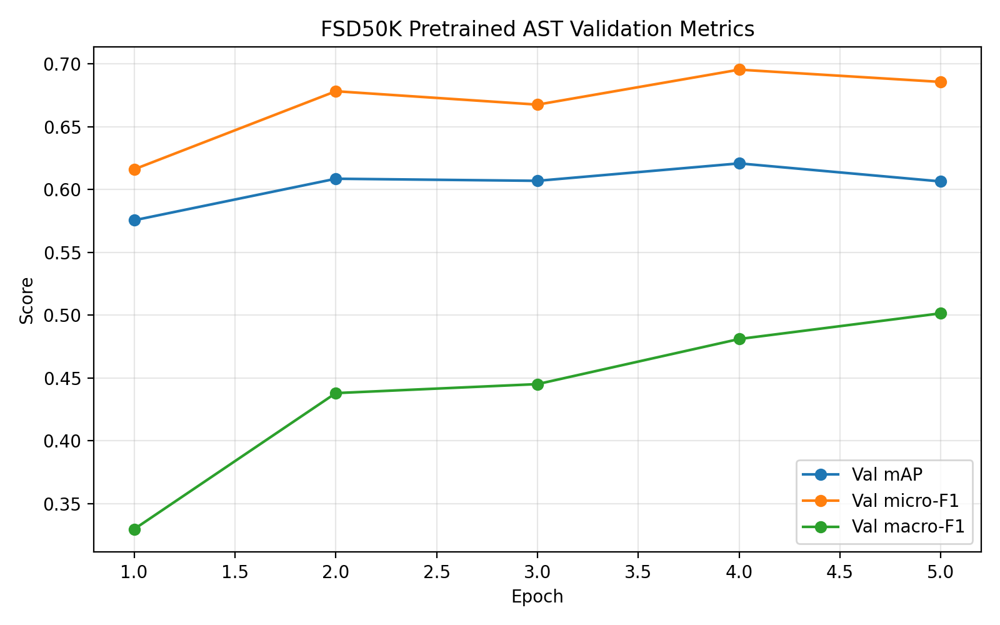
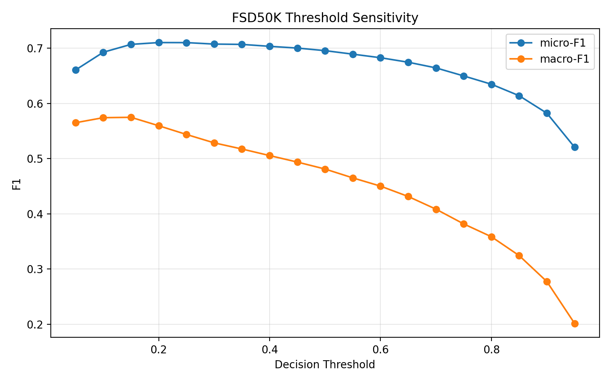
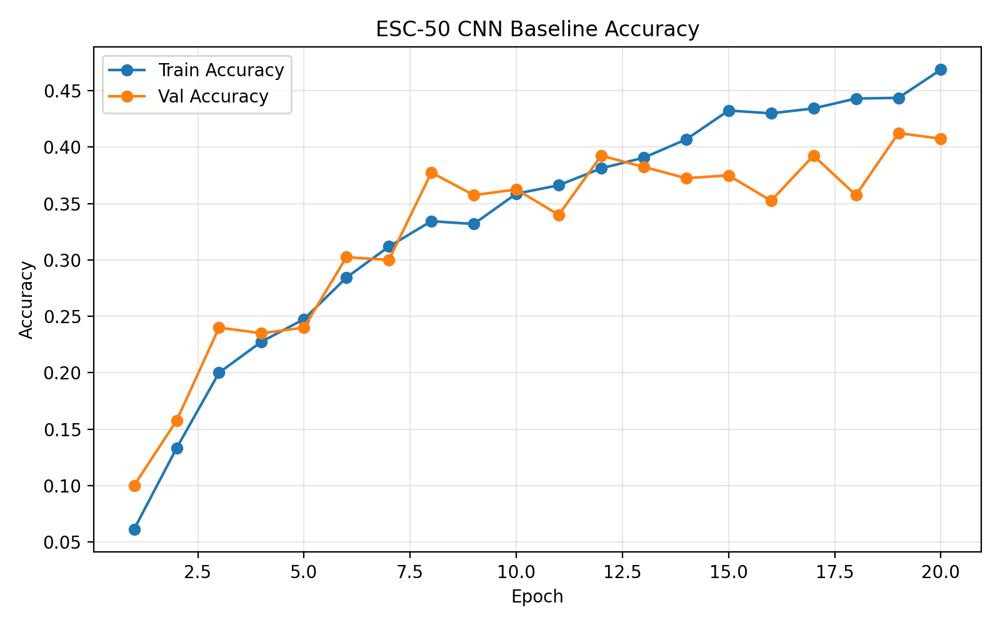
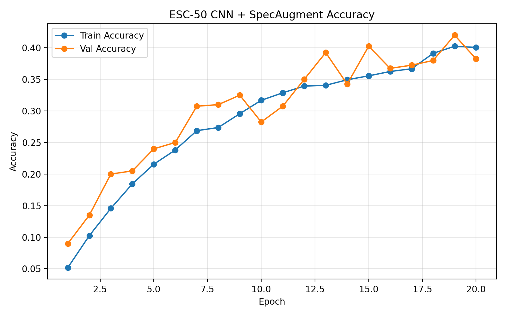
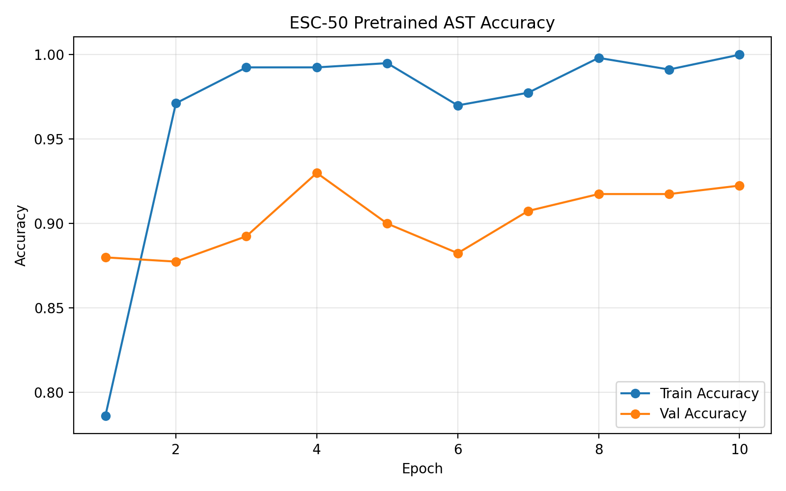
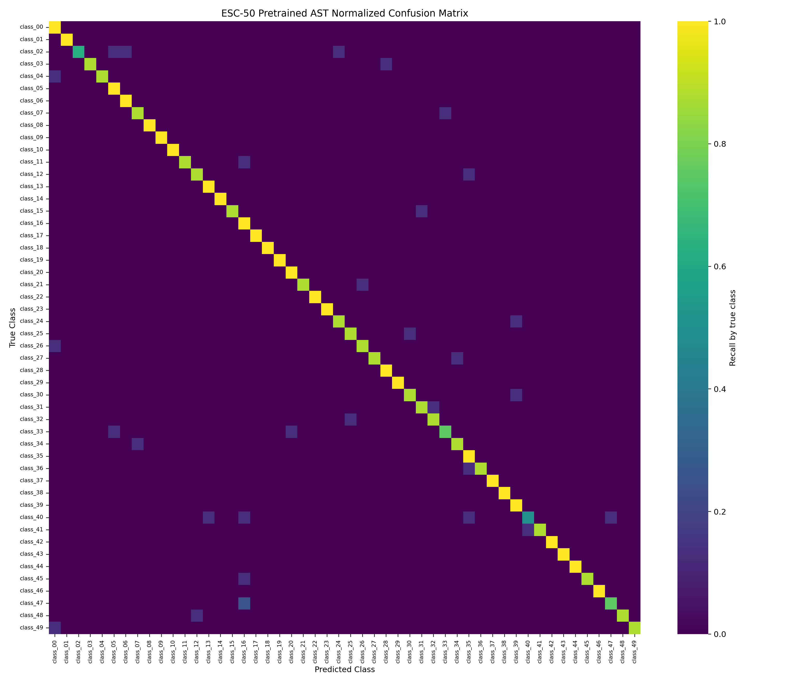

# 基于预训练 Audio Spectrogram Transformer 的声音事件分类模型报告

## 摘要

声音事件分类旨在从环境音频中识别具有语义意义的声音类别，是计算机听觉和多媒体理解中的基础任务。本项目围绕 ESC-50 环境声音分类数据集，研究 Log-Mel Spectrogram、CNN baseline、SpecAugment 数据增强和预训练 Audio Spectrogram Transformer（AST）微调在小规模声音事件分类中的表现，并进一步扩展到 FSD50K 多标签声音事件分类。ESC-50 实验采用官方 fold 划分，将 fold 1-4 作为训练集、fold 5 作为验证集。结果显示，从头训练的 CNN baseline 最佳验证 Accuracy 为 0.4125，加入 SpecAugment 后提升至 0.4200，提升幅度较小；而使用 AudioSet 预训练 AST 微调后，最佳验证 Accuracy 达到 0.9300，相比 CNN baseline 提升 +0.5175。FSD50K 扩展实验中，预训练 AST 在 200 类多标签任务上取得最佳验证 mAP 0.6208。实验表明，大规模音频预训练 Transformer 在小规模单标签分类和更真实的多标签声音事件分类中都具有较强迁移能力。项目最终形成了可复现训练代码、Slurm 脚本、训练曲线、混淆矩阵、类别级指标、多标签指标和实验日志。

**关键词：** 声音事件分类；ESC-50；Log-Mel Spectrogram；SpecAugment；Audio Spectrogram Transformer；迁移学习

## 1. 引言

声音事件分类（Sound Event Classification）关注从环境音频中识别声源或事件类别，例如动物声、自然声、交通声、人类活动声和机械声等。与语音识别不同，声音事件分类通常不处理语言内容，而是依赖声学事件的时频结构、持续时间、频率分布和背景噪声模式。该任务可用于智能监控、环境感知、机器人听觉、多媒体检索和辅助听觉系统。

传统声音分类方法依赖 MFCC、谱质心、短时能量等人工特征，并结合支持向量机或浅层分类器。这类方法实现简单，但对复杂环境声的表达能力有限。随着深度学习发展，研究逐渐转向将音频转换为 Mel-Spectrogram 或 Log-Mel Spectrogram，再使用 CNN、Transformer 或预训练模型完成分类。CNN 能够捕捉局部时频纹理，但对长程时间依赖和跨频带关系的表达有限。Vision Transformer 和 Audio Spectrogram Transformer 则将频谱图切分为 patch，通过自注意力建模全局关系，为声音事件分类提供了新的模型路线。

本项目的研究问题是：在课程项目可用时间和算力条件下，如何利用 Log-Mel Spectrogram 与预训练 Transformer 模型，构建一个可复现、可评估、具有较好泛化能力的声音事件分类系统？围绕该问题，项目设计了三组递进实验：CNN baseline、CNN + SpecAugment、Pretrained AST fine-tuning。通过这些实验，可以比较从头训练小模型、频谱增强策略和预训练 Transformer 迁移之间的差异。

## 2. 相关研究

ESC-50 是环境声音分类中常用的小规模基准数据集，包含 50 个类别和 2000 条音频样本，每类 40 条，使用 5-fold 划分便于可复现实验[2]。AudioSet 则是大规模弱标注声音事件数据集，覆盖数百个音频事件类别，常被用于音频预训练和下游迁移[3]。FSD50K 基于 Freesound 和 AudioSet ontology 构建，适合真实多标签声音事件分类研究[4]。

在模型方面，早期深度学习方法常使用 Log-Mel Spectrogram 与 CNN。CNN 的局部归纳偏置适合学习短时频谱纹理，但在数据较少或类别相似时容易受到局部模式限制。PANNs 等工作证明，在大规模音频数据上预训练 CNN 可以显著提升下游声音任务性能[5]。

Transformer 方法进一步推动了音频频谱图建模。AST 将音频频谱图切分为 patch，并使用类似 ViT 的 Transformer 编码器完成音频分类，在 AudioSet、ESC-50 和 Speech Commands 等任务上取得较强表现[6]。PaSST 和 HTS-AT 等后续研究从 patchout、层次结构和高效训练角度改进音频 Transformer[7][8]。这些工作说明，频谱图 Transformer 在音频任务中具有较强潜力，但通常依赖预训练和合适的微调策略。

数据增强也是小样本声音分类的重要手段。SpecAugment 通过随机遮挡频谱图中的时间片段和频率带，增强模型对局部缺失和噪声扰动的鲁棒性[9]。mixup、Patchout、类别均衡采样和标签增强等策略也常用于改善泛化能力[7][10][11]。不过，数据增强的效果依赖模型结构、数据规模和参数强度，需要通过实验验证。

## 3. 数据集与预处理

本项目使用 ESC-50 数据集完成主要单标签实验，并使用 FSD50K 作为多标签扩展实验。ESC-50 包含 50 个环境声音类别，每类 40 条音频，共 2000 条样本。项目采用官方 fold 划分，fold 1-4 作为训练集，fold 5 作为验证集。

| 划分 | Fold | 样本数 |
| --- | --- | ---: |
| 训练集 | 1, 2, 3, 4 | 1600 |
| 验证集 | 5 | 400 |

数据读取流程包括 WAV 文件读取、重采样、裁剪或补零到固定长度。CNN 相关实验使用 32 kHz 音频输入，并在训练循环中转换为 Log-Mel Spectrogram。AST 实验使用 16 kHz 音频输入，以匹配 Hugging Face 预训练 AST 模型的默认特征提取设置。

项目已同步 ESC-50 官方元数据到 `metadata/esc50.csv`，因此分析脚本可以将数字标签映射为真实类别名称。后续混淆矩阵和类别级指标均使用真实类别名，便于解释具体错误类别。

FSD50K 扩展实验使用官方 dev split 中的 train / val 划分，共 200 个 AudioSet ontology 类别。与 ESC-50 不同，FSD50K 是 clip-level 多标签任务，一条音频可能同时包含多个声音事件，因此使用 multi-hot 标签表示，并以 mAP、micro-F1 和 macro-F1 作为主要评价指标。

## 4. 方法

### 4.1 CNN Baseline

CNN baseline 的目标是建立完整、可复现的声音分类流程。模型输入为 Log-Mel Spectrogram，结构包含三组卷积、BatchNorm、ReLU 和 MaxPool 模块，最后通过全局池化与线性分类层输出 50 类预测。该模型不是项目最终创新点，而是用于验证数据管线、训练循环、评估指标和 Slurm 运行流程。

### 4.2 CNN + SpecAugment

CNN + SpecAugment 保持 CNN baseline 的模型结构和训练划分不变，只在训练阶段对 Log-Mel Spectrogram 执行时间遮挡和频率遮挡。验证阶段不启用增强，以保证评价结果与 baseline 可比。该实验用于检验频谱增强是否能改善轻量 CNN 的泛化能力。

### 4.3 Pretrained AST Fine-tuning

预训练 AST 实验使用 `MIT/ast-finetuned-audioset-10-10-0.4593` 初始化模型。该模型来自 AudioSet 预训练/微调，因此已学习到较丰富的声音事件表征。由于原始分类头对应 AudioSet 527 类，而 ESC-50 只有 50 类，实验重新初始化分类头并保留 AST 主干预训练权重。

训练脚本使用 Hugging Face `AutoFeatureExtractor` 将 waveform 转换为 AST 输入，再使用 `AutoModelForAudioClassification` 进行单标签分类微调。AST 实验在 Slurm GPU 分区运行，输出格式与 CNN 实验保持一致，包括 `history.json`、`latest_val_metrics.json` 和最佳模型权重。

## 5. 实验设置

所有实验使用相同训练/验证 fold，以 Accuracy 和 Loss 作为主要评价指标，并生成训练曲线、混淆矩阵和类别级指标。

| 实验 | 配置文件 | 训练轮数 | 主要设置 |
| --- | --- | ---: | --- |
| CNN baseline | `configs/esc50_baseline.yaml` | 20 | 32 kHz，Log-Mel Spectrogram，轻量 CNN |
| CNN + SpecAugment | `configs/esc50_cnn_specaugment.yaml` | 20 | CNN baseline + 时间/频率遮挡 |
| Pretrained AST | `configs/esc50_ast.yaml` | 10 | 16 kHz，AudioSet 预训练 AST 微调 |
| FSD50K Pretrained AST | `configs/fsd50k_ast.yaml` | 5 | 16 kHz，200 类多标签 AST 微调 |

训练和分析代码均已保存到项目仓库。CNN 与 SpecAugment 实验可使用 `scripts/train.py` 运行，AST 实验使用 `scripts/train_ast.py`。实验结果通过 `scripts/analyze_esc50_results.py` 生成图表，通过 `scripts/compare_esc50_experiments.py` 生成多实验对比摘要。

## 6. 实验结果

三组实验的主要结果如下。

| 实验 | 最佳轮次 | 最佳验证 Accuracy | 最佳验证 Loss | 最后一轮训练 Accuracy | 最后一轮验证 Accuracy |
| --- | ---: | ---: | ---: | ---: | ---: |
| CNN baseline | 19 | 0.4125 | 2.0202 | 0.4688 | 0.4075 |
| CNN + SpecAugment | 19 | 0.4200 | 2.0417 | 0.4006 | 0.3825 |
| Pretrained AST | 4 | 0.9300 | 0.2205 | 1.0000 | 0.9225 |

CNN baseline 的最佳验证 Accuracy 为 0.4125，明显高于 50 类随机分类约 0.0200，说明基础训练流程有效。加入 SpecAugment 后，最佳验证 Accuracy 提升至 0.4200，相比 baseline 提升 +0.0075，但最后一轮验证 Accuracy 回落到 0.3825，说明增强效果较弱且不够稳定。

预训练 AST 的最佳验证 Accuracy 达到 0.9300，相比 CNN baseline 提升 +0.5175，相比 CNN + SpecAugment 提升 +0.5100。AST 在第 4 轮达到最佳结果，最后一轮验证 Accuracy 仍保持 0.9225，表明预训练 Transformer 在 ESC-50 上具有显著迁移优势。

FSD50K 多标签扩展实验运行 5 轮，最佳验证 mAP 为 0.6208，出现在第 4 轮；对应验证 micro-F1 为 0.6955，macro-F1 为 0.4810。最后一轮验证 mAP 为 0.6064，micro-F1 为 0.6857，macro-F1 为 0.5015。该结果说明 AST 已成功扩展到更真实的多标签声音事件分类场景，但 macro-F1 明显低于 micro-F1，也反映出长尾类别和类别不均衡仍然是 FSD50K 的主要挑战。

进一步的类别级分析显示，AP 较高的类别包括 `Burping_and_eructation`、`Cat`、`Thunder`、`Thunderstorm` 和 `Toilet_flush`，其 AP 均超过 0.96；这些类别通常具有较明确的声学形态或较强的事件特征。AP 较低的类别包括 `Tick`、`Screech`、`Wood`、`Chatter` 和 `Rattle`，其中部分类别在 0.50 阈值下 F1 为 0，说明模型虽然能学习到整体多标签语义，但对短促、抽象或容易与其他事件共现的声音类别仍不稳定。

阈值敏感性分析进一步说明，固定 0.50 阈值并不是当前 FSD50K 验证集上的最佳决策边界。阈值从 0.50 降到 0.20 时，micro-F1 从 0.6955 提升到 0.7101；阈值为 0.15 时 macro-F1 达到 0.5747，高于 0.50 阈值下的 0.4810。这表明较低阈值可以提升低频类别召回率，对类别不均衡明显的多标签声音事件分类更合适。

## 7. 曲线与混淆矩阵分析

CNN baseline 的训练和验证 Accuracy 随 epoch 整体上升，但验证曲线波动明显，说明模型能够学习部分环境声模式，但泛化能力有限。

SpecAugment 实验的训练 Accuracy 低于 baseline，表明频谱遮挡增加了训练难度。虽然最佳验证 Accuracy 略高于 baseline，但提升较小，暂时只能作为轻微正向改进。

AST 实验在前几轮快速收敛，并在第 4 轮达到 0.9300 的最佳验证 Accuracy。该现象说明模型主干已经通过 AudioSet 预训练获得较强音频表征，ESC-50 微调主要完成类别适配。

从混淆矩阵看，CNN baseline 和 SpecAugment 仍存在较多类别混淆，部分类别 Accuracy 为 0。例如 CNN baseline 中 `pig`、`hen`、`sheep`、`chirping_birds` 和 `breathing` 均未被正确识别。AST 的混淆矩阵对角线更清晰，大多数类别都能被正确识别。当前 AST 中较弱类别也明显优于 CNN 实验，例如 `helicopter` 的 Accuracy 为 0.5000，`pig` 为 0.6250，`door_wood_creaks` 和 `airplane` 为 0.7500。

## 8. 讨论

实验结果支持项目的核心假设：在小规模声音事件分类任务中，预训练音频 Transformer 的迁移学习效果显著优于从头训练的小型 CNN。CNN baseline 的价值在于验证流程可行，并提供可复现对照；SpecAugment 提供了训练策略比较，但当前参数下提升有限；AST 则构成项目最重要的模型结果。

AST 的优势主要来自两个方面。第一，AudioSet 预训练提供了大量声音事件相关先验，使模型不需要完全从 ESC-50 的 1600 条训练样本中学习底层声学表征。第二，Transformer 的自注意力机制能够在频谱图 patch 之间建模长程关系，有助于区分具有复杂时频结构的环境声音。该结果与文献综述中的判断一致：音频 Transformer 在小样本任务上通常需要预训练支持，而不是从头训练。

SpecAugment 的有限提升也值得注意。它降低了训练 Accuracy，说明增强确实增加了训练难度，但验证收益不明显。这可能是因为当前 CNN 模型容量较小，或者遮挡参数并未针对 ESC-50 调优。后续若继续研究增强策略，可以尝试更弱遮挡、多次重复实验、多 fold 验证或与预训练模型结合。

## 9. 局限性

当前实验主要有三点局限。首先，ESC-50 结果基于单一 fold 划分，尚未完成 5-fold 交叉验证。其次，AST 在 ESC-50 上最后一轮训练 Accuracy 达到 1.0000，说明模型容量较大，仍需要关注过拟合和早停策略。第三，FSD50K 目前只完成了 5 epoch 初步微调，虽然已经补充类别级 AP/F1 和阈值敏感性分析，但尚未进行更系统的阈值校准、长尾类别重采样或测试集提交，因此多标签结论仍属于扩展实验初步结果。

这些局限不会改变当前主结论，但在最终报告中需要明确说明。尤其是如果希望报告更严谨，应补充多 fold 验证或至少将单 fold 设置解释为课程项目中的可控验证方案。

## 10. 未来工作

后续工作可以从三个方向展开。第一，围绕 `helicopter`、`pig`、`door_wood_creaks`、`airplane` 等 ESC-50 相对较弱类别补充更细的错误案例分析。第二，对 ESC-50 AST 进行轻量调参，例如减少训练轮数、加入早停、调整学习率或冻结部分层，以验证 0.9300 Accuracy 的稳定性。第三，在 FSD50K 上继续做类别级优化和阈值校准，例如针对 `Tick`、`Screech`、`Wood` 等低 AP 类别调整采样策略、损失权重或类别阈值；音视频预训练迁移则继续作为更远期未来工作。

## 11. AI 工具使用说明

本项目使用 AI 工具辅助完成文献梳理、项目计划整理、代码框架生成、训练脚本调试、实验日志记录和报告初稿撰写。实验指标、训练结果和结论均来自实际运行的代码和服务器输出，最终技术判断需要结合原始论文、实验记录和项目代码进行人工复核。

## 12. 结论

本项目完成了基于 ESC-50 的声音事件分类实验闭环，并进一步扩展到 FSD50K 多标签分类。ESC-50 实验覆盖数据准备、模型训练、Slurm 运行、结果保存、曲线绘制、混淆矩阵和实验报告整理；FSD50K 实验补充了多标签数据读取、mAP、micro-F1、macro-F1、类别级 AP/F1 和阈值敏感性分析。实验结果表明，CNN baseline 可以有效跑通流程，但性能有限；SpecAugment 在当前设置下仅带来轻微提升；预训练 AST 微调显著提升 ESC-50 分类性能，最佳验证 Accuracy 达到 0.9300；在 FSD50K 多标签任务上，预训练 AST 获得最佳验证 mAP 0.6208，且通过阈值扫描可将 micro-F1 提升到 0.7101。由此可见，利用大规模音频预训练 Transformer 进行迁移学习，是比从头训练轻量 CNN 更有效、更可扩展的方案。

## 参考文献

[1] A. Dosovitskiy et al., “An Image is Worth 16x16 Words: Transformers for Image Recognition at Scale,” in *Proc. ICLR*, 2021.

[2] K. J. Piczak, “ESC: Dataset for Environmental Sound Classification,” in *Proc. ACM Multimedia*, 2015.

[3] J. F. Gemmeke et al., “Audio Set: An ontology and human-labeled dataset for audio events,” in *Proc. ICASSP*, 2017.

[4] E. Fonseca et al., “FSD50K: an Open Dataset of Human-Labeled Sound Events,” *IEEE/ACM Transactions on Audio, Speech, and Language Processing*, 2022.

[5] Q. Kong et al., “PANNs: Large-Scale Pretrained Audio Neural Networks for Audio Pattern Recognition,” *IEEE/ACM Transactions on Audio, Speech, and Language Processing*, 2020.

[6] Y. Gong, Y.-A. Chung, and J. Glass, “AST: Audio Spectrogram Transformer,” in *Proc. Interspeech*, 2021.

[7] K. Koutini et al., “Efficient Training of Audio Transformers with Patchout,” in *Proc. Interspeech*, 2022.

[8] K. Chen et al., “HTS-AT: A Hierarchical Token-Semantic Audio Transformer for Sound Classification and Detection,” in *Proc. ICASSP*, 2022.

[9] D. S. Park et al., “SpecAugment: A Simple Data Augmentation Method for Automatic Speech Recognition,” in *Proc. Interspeech*, 2019.

[10] H. Zhang et al., “mixup: Beyond Empirical Risk Minimization,” in *Proc. ICLR*, 2018.

[11] Y. Gong et al., “PSLA: Improving Audio Tagging with Pretraining, Sampling, Labeling, and Aggregation,” *IEEE/ACM Transactions on Audio, Speech, and Language Processing*, 2021.
