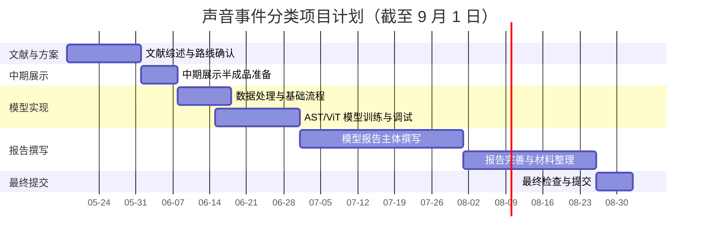

# 声音事件分类项目计划

## 1. 项目总体目标

本项目面向“基于深度学习的声音事件分类”任务，主线方案为：将音频转换为 Mel-Spectrogram 或 Log-Mel Spectrogram，再使用 Vision Transformer / Audio Spectrogram Transformer 类模型完成声音事件分类。项目优先采用 ESC-50 作为快速验证数据集，用于尽早跑通数据读取、特征提取、模型训练、评估和结果记录流程；在基础流程稳定后，以 FSD50K 作为主实验或扩展实验数据集，提升任务真实性和报告内容深度。

AudioSet 不作为本项目第一阶段直接训练或完整下载的数据集，主要用于说明大规模声音事件分类研究背景，并作为 AST 等模型预训练权重来源。VGGSound 不作为主线训练数据集，主要用于支撑课程要求中的 video-audio 模型迁移备选方向。如果主线完成后仍有时间和算力，可将 VGGSound 相关预训练模型或音视频迁移思路作为扩展实验或未来工作。

项目最终提交目标为 9 月 1 日前完成模型报告、项目代码和项目日志。6 月初需要准备中期展示，展示内容应保留一个“快要完成但仍可继续优化”的半成品版本：即完成文献综述、数据集路线、预处理方案、初步代码框架、样例频谱图和基础模型设计，但模型训练结果可以只展示初步 baseline 或正在训练中的结果，为后续改进保留空间。6 月底完成模型主体；7 月至 8 月集中完成模型报告、实验分析、项目日志整理和最终材料打包。

## 2. 阶段安排

| 阶段                 | 时间       | 阶段目标                   | 主要任务                                                                                                | 阶段产出                       |
| ------------------ | -------- | ---------------------- | --------------------------------------------------------------------------------------------------- | -------------------------- |
| 第 1 阶段：文献综述与方案确认   | 5 月中下旬   | 完成研究背景、技术路线和数据集选择      | 整理 ViT、AST、Audio-MAE、VATT、ISMIR 音频 Transformer 等文献；明确 ESC-50、FSD50K、AudioSet、VGGSound 的定位；确定主线和备选方向 | `文献综述.md`、项目计划、参考文献列表      |
| 第 2 阶段：中期展示半成品准备   | 6 月初     | 准备一个接近完成但仍可继续优化的中期展示版本 | 展示研究背景、文献综述、数据集路线、预处理流程、模型结构图、样例 Mel-Spectrogram、代码框架和初步 baseline 思路；保留后续模型训练、调参和改进实验空间             | 中期展示材料、半成品代码框架、样例结果        |
| 第 3 阶段：数据处理与基础模型实现 | 6 月上中旬   | 跑通从音频到分类结果的完整流程        | 下载并整理 ESC-50；实现音频读取、重采样、固定长度裁剪/填充、Mel-Spectrogram 提取；搭建 ViT/AST 分类训练脚本；完成训练、验证和测试流程                 | 数据处理脚本、训练脚本、基础 baseline 结果 |
| 第 4 阶段：模型完成与主要实验   | 6 月下旬    | 在 6 月底前完成模型主体          | 使用预训练 AST 或 ViT 类模型完成 ESC-50 训练；加入必要的数据增强；记录 Accuracy、Loss、混淆矩阵；评估是否扩展到 FSD50K 小规模实验                | 可运行模型、主要实验结果、实验日志          |
| 第 5 阶段：模型报告撰写      | 7 月      | 完成模型报告主体内容             | 撰写引言、文献综述、数据集与预处理、方法设计、实验设置、实验结果与评估；整理图表、训练曲线、混淆矩阵和对比实验                                             | 模型报告初稿                     |
| 第 6 阶段：报告完善与材料整理   | 8 月      | 完成最终报告、代码和日志整理         | 补充讨论、局限性、未来工作和结论；统一参考文献格式；检查代码可复现性；整理项目日志和 README；准备最终压缩包                                           | 模型报告终稿、项目代码、项目日志、提交包       |
| 第 7 阶段：最终提交        | 9 月 1 日前 | 完成全部课程材料提交             | 最终检查报告格式、代码完整性、日志完整性、AI 工具使用说明和压缩包内容                                                                | 最终提交材料                     |

## 3. 甘特图

## 4. 中期展示安排

6 月初的中期展示不宜展示一个完全结束的项目，而应展示一个“快要完成、后续仍能继续优化”的半成品。建议展示内容包括：

1. 项目背景和研究意义：说明声音事件分类的应用场景，以及为什么选择 Mel-Spectrogram + ViT/AST 路线。
2. 文献综述进展：概括 ViT、AST、自监督音频表征、音视频迁移相关研究。
3. 数据集选择：说明 ESC-50 用于快速验证，FSD50K 用于主实验或扩展实验，AudioSet 作为预训练背景，VGGSound 作为音视频迁移备选依据。
4. 方法设计：展示音频重采样、裁剪/填充、Mel-Spectrogram 提取、patch 输入 Transformer、分类头输出结果的整体流程。
5. 初步实现：展示项目代码结构、样例频谱图、模型输入输出格式和初步训练计划。
6. 保留优化空间：说明后续将完成模型训练、调参、预训练权重微调、数据增强、评估指标和报告分析。

中期展示的重点是证明项目路线清楚、实现方向可行、已经开始落地，但不需要把最终模型性能完全展示出来。这样既符合中期检查的要求，也能为 6 月底模型完成和 7-8 月报告撰写保留合理进展空间。

## 5. 预期成果

### 5.1 基础目标

基础目标是在 ESC-50 上完成一个可运行的声音事件分类 baseline。具体包括：完成音频读取、Mel-Spectrogram 提取、训练/验证/测试划分、ViT/AST 分类模型训练、Accuracy 评估和基础实验日志记录。

### 5.2 中级目标

中级目标是在基础 baseline 上加入预训练权重和数据增强，比较随机初始化、预训练 AST、SpecAugment/Mixup 等策略的影响。如果时间允许，可以在 FSD50K 上完成小规模或完整实验，并补充多标签评价指标。

### 5.3 高级目标

高级目标是探索自监督音频表示或音视频迁移方向。Audio-MAE 可作为自监督音频表征的未来改进方向；VGGSound/VATT 可作为 video-audio 迁移的备选方向。该部分不作为必须完成的核心任务，主要用于报告中的扩展讨论或可选实验。

## 6. 成功标准

项目成功至少应满足以下标准：

1. 能够从音频数据集中读取样本，并稳定生成 Mel-Spectrogram 或 Log-Mel Spectrogram。
2. 能够训练 ViT/AST 类声音事件分类模型，并输出可复现的训练日志和评估结果。
3. 在 ESC-50 上获得明显高于随机分类的 Accuracy，并能通过混淆矩阵分析主要错误类别。
4. 模型报告包含引言、文献综述、数据集与预处理、方法设计、实验设置、实验结果与评估、讨论、局限性、结论和参考文献。
5. 项目日志按日期记录研究过程、遇到的问题、解决方案、实验记录和阶段性结论。
6. 最终提交材料在 9 月 1 日前整理完成，包括模型报告、项目代码和项目日志。

## 7. 风险与应对

| 风险                  | 影响         | 应对策略                                |
| ------------------- | ---------- | ----------------------------------- |
| ESC-50 样本量小，模型可能过拟合 | 验证集准确率不稳定  | 使用预训练权重、数据增强、冻结部分层、交叉验证             |
| FSD50K 数据处理复杂       | 主实验进度延迟    | 先完成 ESC-50 baseline，再决定是否扩展到 FSD50K |
| AudioSet 下载和训练成本过高  | 项目范围失控     | 不直接使用完整 AudioSet，只使用相关预训练权重和文献背景    |
| VGGSound 下载和多模态处理复杂 | 音视频迁移难以落地  | 将其作为备选方向和未来工作，不影响主线完成               |
| 6 月底模型完成压力较大        | 报告阶段缺少稳定结果 | 6 月初保留半成品展示，6 月中旬优先完成最小可运行模型        |
| 7-8 月报告内容较多         | 最终文档质量不足   | 7 月先完成报告主体，8 月集中润色、补图表和整理日志         |

## 8. 最终交付清单

最终在 9 月 1 日前应完成以下材料：

1. 模型报告：包含完整学术报告结构和 IEEE 参考文献格式。
2. 项目代码：包含数据处理、模型训练、评估和必要配置。
3. 项目日志：记录研究过程、问题、解决方案、实验进展和结果分析。
4. 辅助材料：中期展示材料、主要实验图表、训练曲线、混淆矩阵和必要说明。
