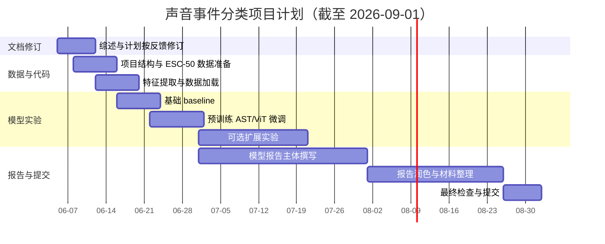

# 声音事件分类项目计划

## 1. 项目概述

本项目研究基于深度学习的声音事件分类（Sound Event Classification）。项目主线是将环境音频转换为 Log-Mel Spectrogram 或 Mel-Spectrogram，再使用 Vision Transformer / Audio Spectrogram Transformer 类模型完成声音事件分类。该路线与课程要求中的 ViT 方向一致，同时能够和当前音频分类研究中的频谱图 Transformer、预训练迁移和数据增强方法衔接。

项目计划文档只负责说明本项目要解决什么问题、预期产出是什么、如何实施、如何评价和如何控制风险。已有研究的详细讨论放在 `文献综述.md` 中，二者分工如下：

| 文档 | 主要职责 |
| --- | --- |
| `文献综述.md` | 讨论已有研究、技术脉络、方法比较、研究空白和后续研究启示。 |
| `项目计划.md` | 明确研究问题、预期成果、实验路线、时间安排、成功标准和风险应对。 |

## 2. Research Question

本项目拟解决的核心研究问题是：

> 在课程项目可用时间和算力条件下，如何利用 Mel-Spectrogram / Log-Mel Spectrogram 与预训练 Transformer 模型，构建一个可复现、可评估、具有较好泛化能力的声音事件分类系统？

围绕该核心问题，项目进一步拆分为以下子问题：

1. 如何把原始音频稳定转换为适合 Transformer 输入的二维时频表示？
2. 在 ESC-50 这类小规模数据集上，预训练 AST/ViT 类模型相比从头训练或简单 CNN baseline 是否更稳定？
3. SpecAugment、mixup、冻结/解冻预训练层等策略能否缓解小样本过拟合？
4. 如果扩展到 FSD50K，多标签任务应如何调整损失函数、标签表示和评价指标？
5. 音视频迁移方向在本项目中适合作为可选扩展还是主要实验路线？

## 3. Intended Outcomes

本项目预期成果分为基础目标、中级目标和高级目标，便于根据实际时间、算力和数据可得性逐步推进。

| 层级 | 预期成果 | 难度 | 风险 |
| --- | --- | --- | --- |
| 基础目标 | 在 ESC-50 上跑通完整声音事件分类流程，包括音频读取、重采样、裁剪/填充、Log-Mel Spectrogram 提取、训练、验证、测试和结果记录。 | 中等 | 数据量小，模型容易过拟合；需要保证划分和随机种子可复现。 |
| 中级目标 | 使用预训练 AST/ViT 类模型微调，并比较数据增强、冻结策略和基础 baseline 的影响。 | 中高 | 预训练权重、输入尺寸和依赖环境可能需要调试；训练时间可能增加。 |
| 高级目标 | 尝试 FSD50K 小规模或完整多标签实验，或探索音视频预训练表征迁移。 | 高 | FSD50K 数据处理复杂；音视频迁移下载和工程成本较高。 |

最终希望交付的成果包括：

1. 一份结构清楚的模型报告，包含引言、文献综述、数据集与预处理、方法设计、实验设置、实验结果与评估、讨论、局限性、未来工作、结论和参考文献。
2. 一套可运行项目代码，覆盖数据处理、模型训练、评估和结果保存。
3. 一份项目日志，按日期记录研究过程、遇到的问题、解决方案、实验记录和阶段性结论。
4. 若时间允许，补充混淆矩阵、训练曲线、样例频谱图、错误案例分析和可选扩展实验。

## 4. 数据集与实验范围

项目采用“快速验证 + 主实验候选 + 预训练背景 + 可选扩展”的数据策略。

| 数据集 | 在项目中的定位 | 使用方式 |
| --- | --- | --- |
| ESC-50 | 快速验证与基础 baseline | 优先使用，完成单标签分类闭环，报告 Accuracy、Loss、混淆矩阵和错误类别分析。 |
| FSD50K | 明确扩展实验 | 在 ESC-50 流程稳定后进入；作为多标签声音事件分类扩展，报告 mAP、micro-F1 和 macro-F1。 |
| AudioSet | 预训练背景 | 不直接完整下载和训练，主要作为 AST/PANNs 等预训练权重来源和研究背景。 |
| VGGSound | 音视频迁移备选 | 不作为主线数据集；仅在主线完成后考虑使用已有音视频预训练表征做扩展。 |

选择该范围的原因是：ESC-50 规模小、结构清晰，适合快速发现代码和训练问题；FSD50K 更真实且具有多标签标注，适合作为 ESC-50 主线完成后的明确扩展；AudioSet 和 VGGSound 规模大、下载不确定性高，不适合作为本项目直接完整训练对象。

## 5. 方法设计

项目基础流程如下：

1. 音频读取：读取 WAV 或数据集原始音频文件，并记录采样率、时长和类别标签。
2. 音频预处理：统一采样率，对过短音频进行填充，对过长音频进行裁剪或分段。
3. 特征提取：生成 Mel-Spectrogram 或 Log-Mel Spectrogram，并根据模型要求统一时间帧数和频率维度。
4. 模型训练：优先使用预训练 AST/ViT 类模型进行微调；必要时补充 CNN baseline 作为对照。
5. 数据增强：根据实验阶段加入 SpecAugment、mixup、随机裁剪、背景噪声或时间平移。
6. 模型评估：在验证集和测试集上记录 Loss、Accuracy、混淆矩阵和类别级指标；如进入多标签任务，补充 mAP、micro-F1 和 macro-F1。
7. 结果分析：结合训练曲线、混淆矩阵和错误样本分析模型优势与不足。

主线模型选择 AST/ViT 类结构的原因是：该方向直接符合课程要求，并且已有文献证明频谱图 patch 与 Transformer 自注意力适合音频分类。项目不会从一开始就尝试完整音视频模型训练，以免数据下载、视频处理和多模态同步消耗过多时间。

## 6. 时间安排

项目最终提交目标为 2026 年 9 月 1 日前完成模型报告、项目代码和项目日志。阶段安排如下：

| 阶段 | 时间 | 目标 | 主要任务 | 阶段产出 |
| --- | --- | --- | --- | --- |
| 第 1 阶段：文献与计划修订 | 6 月上旬 | 按反馈完成 Literature Review 与 Project Plan 分离 | 增加文献数量和引用密度；重写综述结构；补充 Research Question 与 Intended Outcomes | 修订版 `文献综述.md/docx`、`项目计划.md/docx` |
| 第 2 阶段：代码框架与数据准备 | 6 月上旬至中旬 | 建立最小可运行工程 | 创建项目结构；准备 ESC-50；实现数据集读取和 Log-Mel Spectrogram 提取 | 数据处理脚本、样例频谱图、项目日志模板 |
| 第 3 阶段：基础 baseline | 6 月中旬 | 跑通训练和评估闭环 | 实现 CNN 或轻量 ViT/AST baseline；记录训练曲线和 Accuracy | baseline 结果、初步错误分析 |
| 第 4 阶段：预训练模型微调 | 6 月下旬 | 完成模型主体 | 使用预训练 AST/ViT 微调；比较冻结策略和数据增强 | 主要实验结果、混淆矩阵、实验日志 |
| 第 5 阶段：扩展实验与报告主体 | 7 月 | 完成 FSD50K 扩展和模型报告主体 | 下载并检查 FSD50K；运行多标签 AST 微调；撰写方法、实验、结果和讨论 | 已获得 FSD50K 初步 mAP/micro-F1/macro-F1，模型报告初稿 |
| 第 6 阶段：材料完善 | 8 月 | 整理最终提交材料 | 统一代码、日志、图表、AI 工具说明和参考文献格式 | 报告终稿、项目代码、项目日志 |
| 第 7 阶段：最终检查 | 8 月下旬至 9 月 1 日前 | 完成提交 | 检查文档格式、代码可复现性和压缩包内容 | 最终提交包 |

## 7. 甘特图

## 8. 成功标准与评价指标

项目成功至少应满足以下标准：

1. 能够稳定读取音频数据，并生成尺寸一致、可视化正常的 Log-Mel Spectrogram。
2. 能够完成训练、验证、测试闭环，并保存可复现的配置、随机种子、日志和指标。
3. 在 ESC-50 上获得明显高于随机分类的 Accuracy，并能通过混淆矩阵解释主要错误类别。
4. 能够比较至少两种实验设置，例如 baseline 与预训练模型、无增强与有增强、冻结与解冻策略。
5. 模型报告结构符合学术报告规范，且明确说明 AI 工具使用情况。
6. 项目日志记录完整，包括日期、目标、问题、解决方案、实验记录和结论。

评价指标按任务类型选择：

| 任务类型 | 主要指标 | 辅助分析 |
| --- | --- | --- |
| ESC-50 单标签分类 | Accuracy、Loss | 混淆矩阵、类别级召回率、错误样本可视化 |
| FSD50K 多标签分类 | mAP、micro-F1、macro-F1 | 类别不均衡分析、标签噪声讨论、阈值敏感性分析 |

## 9. 风险与应对

| 风险 | 影响 | 应对策略 |
| --- | --- | --- |
| 文献综述和项目计划边界不清 | 不符合反馈要求 | 综述只讨论已有研究，计划只讨论本项目实施；两个文档分开维护。 |
| ESC-50 样本量小 | 大模型容易过拟合 | 使用预训练权重、数据增强、冻结部分层、交叉验证和早停。 |
| 预训练 AST/ViT 输入尺寸不匹配 | 训练流程调试时间增加 | 固定采样率、Mel 参数和时长；先跑小批量 sanity check。 |
| FSD50K 数据处理复杂 | 扩展实验延期 | 先完成 FSD50K 数据检查脚本和多标签训练入口；必要时先跑较少 epoch 或子集 sanity check。 |
| AudioSet/VGGSound 下载困难 | 项目范围失控 | 不直接完整下载，优先使用已有预训练权重和文献论证。 |
| 训练资源不足 | 无法完成大模型调参 | 优先完成小模型和冻结微调；必要时准备 Slurm 脚本在集群运行。 |
| 最终报告材料分散 | 提交质量下降 | 从 7 月开始同步整理图表、日志、代码说明和 AI 工具说明。 |

## 10. AI 工具使用说明

根据课程要求，最终报告需要说明人工智能工具使用情况。本项目中 AI 工具仅作为研究辅助使用，主要用于：

1. 辅助整理文献综述结构和项目计划框架。
2. 辅助归纳已有研究方向、技术脉络和风险点。
3. 辅助检查文档表达、引用密度和章节逻辑。
4. 辅助生成代码草稿、调试思路和实验记录模板。

最终报告中的技术判断、实验结果、模型指标和结论，需要由项目作者结合原始论文、实际代码和实验记录确认。

## 11. 最终交付清单

最终在 2026 年 9 月 1 日前应完成以下材料：

1. 模型报告：包含完整学术报告结构和规范参考文献。
2. 项目代码：包含数据处理、模型训练、评估、配置和必要说明。
3. 项目日志：记录研究过程、问题、解决方案、实验进展和结果分析。
4. 辅助材料：主要实验图表、训练曲线、混淆矩阵、样例频谱图和 AI 工具使用说明。
